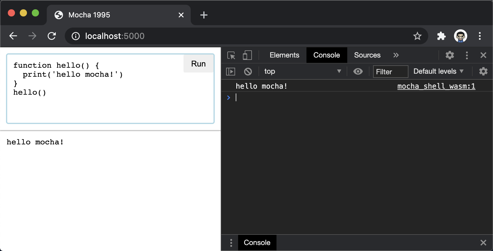

# Mocha 1995
The original Mocha JavaScript engine, ported from Netscape 3.0.2 browser.



## History
"Mocha" was the code name of the first JavaScript engine, originally written by Brendan Eich in his 10-day May 1995 sprint. For all of 1995 and most of 1996, Eich was the the only Netscape developer working full-time on the JavaScript engine. Untill August 1996, the Mocha codebase still consisted primarily of code from the 10-day prototype.

In late 1996, Eich "stayed home for two weeks to rewrite Mocha as the codebase that became known as SpiderMonkey", the JavaScript engine later released as open-source and currently maintained by the Mozilla Foundation.

Here is the source code of production version of Mocha, which ships as JavaScript 1.1. This version is released in August 1996 with Netscape 3.0. The release of JavaScript 1.1 marks the completion of the initial definition and development of JavaScript.

## Live Playground
Besides native binary, the ported Mocha engine can also be compiled to WASM and JavaScript:

* [WASM Version](https://mocha1995.js.org)
* [JavaScript Version](https://mocha1995.js.org#js)

## Build
For WASM and JS build, please make sure [Emscripten](https://emscripten.org/docs/getting_started/downloads.html) is installed and activated (`emcc` command is available):

``` sh
$ source build.sh

# build native
$ compile_native

# build WASM
$ compile_wasm

# build js
$ compile_js
```

The Web build generates `out/mocha_shell_js.html` and `out/mocha_shell_wasm.html` as entries. For the native build, there is a binary runtime available:

``` sh
$ out/mo_shell tests/ack.mocha
```

## CMake
I added CMakeLists.txt so that this project can use CMake. Being able to use CMake, you can use CLion single-step debugging on Linux.

```
cd out
cmake -H"../" -B"./" -DCMAKE_BUILD_TYPE=MinSizeRel
make
```

## Resources
* [Compiling World's First JavaScript Engine Back to JavaScript](./blog/about.md)
* [Netscape 3.0.2 Source Tree](https://archive.org/details/netscape-communicator-3-0-2-source)
* [JavaScript: The First 20 Years](https://doi.org/10.1145/3386327)
* [JavaScript 20 年](https://cn.history.js.org/)

## License
License status of original Netscape source code is unknown yet. This port is intended for historic preservation and educational usage. Don't use in commerial projects!
